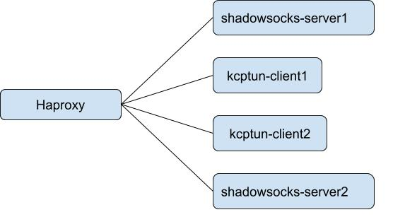

# shadowsocks-haproxy

Haproxy for shadowsocks. There are two kinds of backends: shadowsocks remote servers and kcptun local client. I use a custom httpget to check remote servers status.

## quick start




[httpget](https://github.com/colachg/http-over-socks) is a tools to check backend servers used as external-check in haproxy
```
/ # httpget --help
Usage of httpget:
  -core int
    	number of CPU cores to use (default 1)
  -d	print http response body for debugging
  -k string
    	password
  -m string
    	encryption method, use empty string or rc4
  -nc int
    	number of connection to server (default 1)
  -nr int
    	number of request for each connection (default 1)
  -p int
    	server:port
  -s string
    	server:port (default "127.0.0.1")
```

- `docker-compose up -d` to start services.